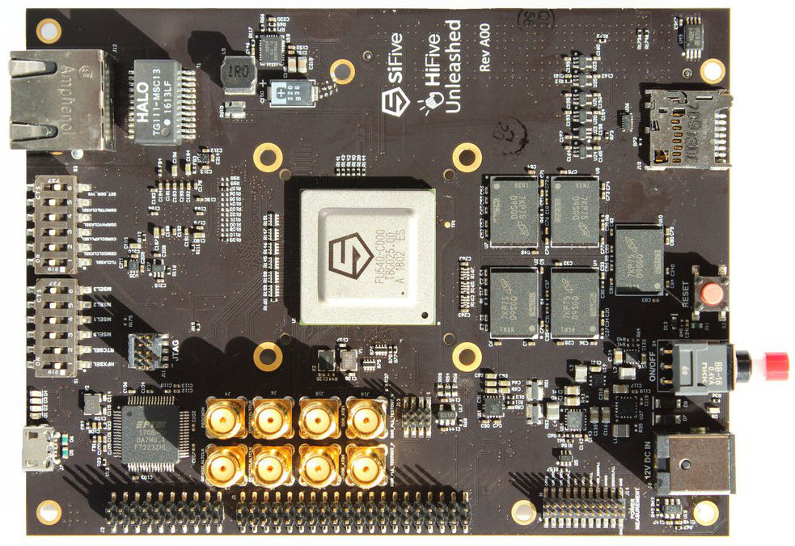

Running 64-bit RISC-V Linux on SiFive HiFive Unleashed
======================================================

SiFive's `HiFive Unleashed <https://www.sifive.com/boards/hifive-unleashed>`_ is a Linux capable development board featuring the Freedom U540, the industry's first commercially available Linux-capable RISC-V SoC.

It's a very good starting point if you want to get Linux running on a physical chip/board.
Just like with the HiFive1, SiFive provides open source schematics, an Altium Designer PCB project, BOM, and - of course - tooling for the HiFive Unleashed.

   The HiFive Unleashed board - top.

.. note:: This chapter targets Debian-based Linux flavors, and has been tested on Ubuntu 18.04.

Prerequisites
-------------

Running Linux on the HiFive Unleashed board requires you to install some prerequisites.

.. code-block:: bash

    sudo apt install autoconf automake autotools-dev bc bison build-essential curl flex \
                     gawk gdisk git gperf libgmp-dev libmpc-dev libmpfr-dev libncurses-dev \
                     libssl-dev libtool patchutils python screen texinfo unzip zlib1g-dev

Getting the sources
-------------------

Clone the official Freedom Unleashed SDK repository and checkout to appropriate version:

.. code-block:: bash

    git clone --recursive https://github.com/sifive/freedom-u-sdk.git
    cd freedom-u-sdk
    git checkout hifive-unleashed
    cd buildroot
    git checkout sifive
    cd ..

.. note:: Recursively cloning the Freedom Unleashed SDK repository may take a while. Should it fail, use ``git submodule update --init --recursive`` inside the ``freedom-u-sdk`` folder to make sure you have all the relevant files.

Building
--------

Simply run:

.. code-block:: bash

    make -j $(nproc)

.. note:: The build process may take some time, do not be discouraged by the wait.

Flashing
--------

Insert an empty SD card and run the following commands:

.. code-block:: bash

    umount /dev/sdx     # change "x" hereinafter with a letter corresponding to your SD card!
    sgdisk --clear \
           --new=1:2048:67583  --change-name=1:bootloader --typecode=1:2E54B353-1271-4842-806F-E436D6AF6985 \
           --new=2:264192:     --change-name=2:root       --typecode=2:0FC63DAF-8483-4772-8E79-3D69D8477DE4 \
           /dev/sdx
    dd if=freedom-u-sdk/work/bbl.bin of=/dev/sdx1 bs=4096
    mke2fs -t ext3 /dev/sdx2

Running
-------

Connect HiFive's USB serial console to your PC.
On the PC, open your favourite serial terminal and connect to the board's serial console using e.g picocom:

.. code-block:: bash

    picocom -b 115200 /dev/ttyUSBX
    # where X is the device number - this can be obtained from e.g. your system log

.. note::

    The UART connection parameters are: baud rate 115200 bps, no flow control, 8bit words, no parity bits.
    The /dev/ttyX device may not appear in the system until the HiFive board is powered.

Power up the board and wait until Linux boots.
The default Linux credentials are:

username
    root

password
    sifive
