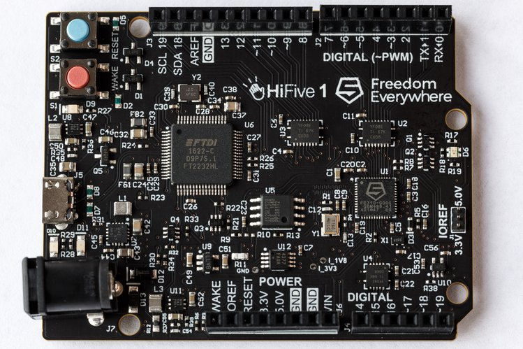

Running Zephyr on SiFive HiFive1
================================

SiFive's `HiFive1 <https://www.sifive.com/products/hifive1/>`_ is an Arduino-Compatible development kit featuring the Freedom E310, the industry's first commercially available RISC-V SoC.

It's a very good starting point if you want to get Zephyr running on a physical chip/board.
SiFive provides open source schematics, an Altium Designer PCB project, BOM, and - of course - tooling for the HiFive1.

   The HiFive1 board - top.

Setting up the enviroment
-------------------------

Please remember to :doc:`get the sources and setup the environment <getting-zephyr>` first.

Getting tools for HiFive1 board
-------------------------------

Download and extract a prebuilt OpenOCD and GDB with RISC-V from SiFive's website:

.. code-block:: bash

    # GDB
    wget https://static.dev.sifive.com/dev-tools/riscv64-unknown-elf-gcc-2018.07.0-x86_64-linux-ubuntu14.tar.gz
    tar xzfv riscv64-unknown-elf-gcc-2018.07.0-x86_64-linux-ubuntu14.tar.gz

    # OpenOCD
    wget https://static.dev.sifive.com/dev-tools/riscv-openocd-2018.7.0-x86_64-linux-ubuntu14.tar.gz
    tar xzfv riscv-openocd-2018.7.0-x86_64-linux-ubuntu14.tar.gz

SiFive provides an open source SDK for their Freedom E platform.

Download Freedom E SDK and move previously downloaded prebuilt tools to their respective directories:

.. code-block:: bash

    git clone https://github.com/sifive/freedom-e-sdk
    mv riscv64-unknown-elf-gcc-2018.07.0-x86_64-linux-ubuntu14/* freedom-e-sdk/riscv-gnu-toolchain
    mv riscv-openocd-2018.7.0-x86_64-linux-ubuntu14/* freedom-e-sdk/openocd

.. note:: If you wish to build the toolchain yourself, please refer to `the instructions on SiFive's GitHub <https://github.com/sifive/freedom-e-sdk/blob/master/README.md>`_.

Compiling an example
--------------------

Create a build directory (we will use ``build-example`` here) and compile an example binary inside it with the following commands:

.. code-block:: bash

    mkdir build-example
    cd build-example
    cmake -DBOARD=hifive1 $ZEPHYR_BASE/samples/hello_world
    make -j $(nproc)
    cd ..

Flashing
--------

Move to your Freedom E SDK directory and connect to the board with OpenOCD:

.. code-block:: bash

    cd freedom-e-sdk
    sudo openocd/bin/openocd -f bsp/env/freedom-e300-hifive1/openocd.cfg

Leave OpenOCD running and connect to the board with GDB, disable flash protection and load the binary (assuming it's in the ``build-example`` directory you've created earlier):

.. prompt:: bash (gdb) auto

    riscv-gnu-toolchain/bin/riscv64-unknown-elf-gdb
    (gdb) set remotetimeout 240
    (gdb) target extended-remote localhost:3333
    (gdb) monitor reset halt
    (gdb) monitor flash protect 0 64 last off
    (gdb) load build-example/zephyr/zephyr.elf
    (gdb) monitor resume

Finally, you can connect with picocom to the serial console:

.. code-block:: bash

    sudo picocom -b 115200 /dev/ttyUSBx  # substitute "x" with appropriate port number

After resetting the board, a hello world message should appear.
You can quit picocom using the :kbd:`C-a` :kbd:`C-q` key strokes.
