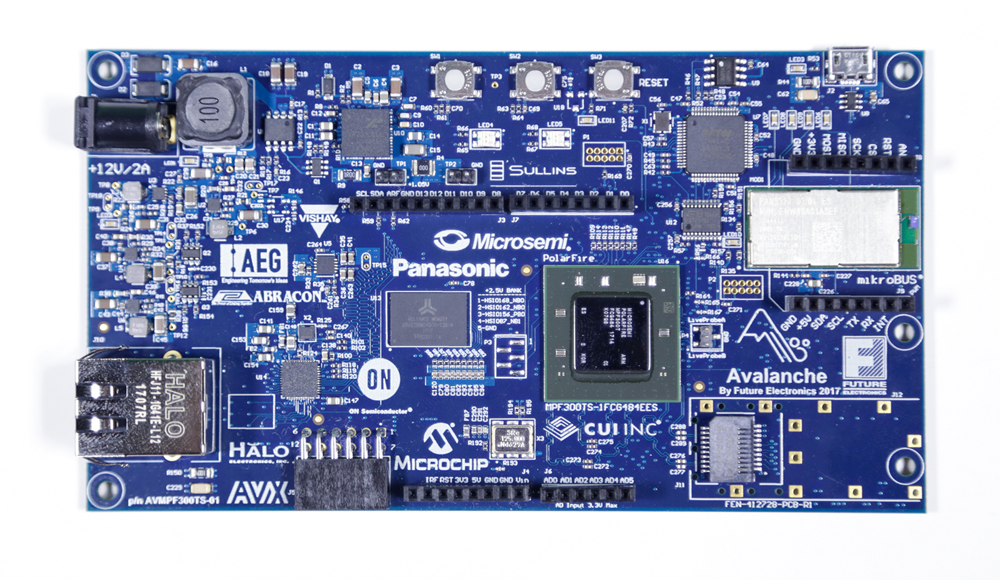

Running Zephyr on LiteX/VexRiscv on Avalanche board with Microsemi PolarFire FPGA
=================================================================================

This section contains a tutorial on how to build and run a shell sample for the Zephyr RTOS on the LiteX soft SoC with an RV32 VexRiscv CPU on the `Future Electronics Avalanche Board <https://www.microsemi.com/existing-parts/parts/139680>`_ with a `PolarFire FPGA <https://www.microsemi.com/product-directory/fpgas/3854-polarfire-fpgas>`_ from Microsemi (a Microchip company) as well as in the `Renode open source simulation framework <https://renode.io>`_.

   The Future Electronics Avalanche board - top.

Building your system
--------------------

Zephyr
++++++

First, :doc:`prepare your environment and get the Zephyr RTOS sources <getting-zephyr>`.

If you want to skip building Zephyr manually, you can download a precompiled `ELF file <https://antmicro.com/projects/renode/litex_vexriscv--zephyr-shell.elf-s_750684-21ab1a23b11ad242acd76f85621380e15b377173>`_ and `binary file <https://antmicro.com/projects/renode/litex_vexriscv--zephyr-shell.bin-s_57912-448675102fa144363b4fb41336bdf02017c4090b>`_.

Building a shell sample
~~~~~~~~~~~~~~~~~~~~~~~

Generate the project build files::

   cd samples/subsys/shell/shell_module
   mkdir build
   cd build
   cmake -DBOARD=litex_vexriscv ..

Build it::

   make -j $(nproc)

As a result, you should find ``zephyr.elf`` and ``zephyr.bin`` in the ``zephyr`` folder.

Running
-------

Preparing the platform
++++++++++++++++++++++

.. tabs::

   .. group-tab:: Hardware

      Download a pregenerated bitstream of LiteX with VexRiscv and BIOS preloded to RAM:

      .. code-block:: text

         wget https://github.com/riscv/risc-v-getting-started-guide/releases/download/tip/bitstream-litex-vexriscv-avalanche-zephyr.job

      Load it onto the Avalanche board using the `PolarFire FlashPro <https://www.microsemi.com/product-directory/programming/4977-flashpro#software>`_ tool.
      You can refer to the "Creating a Job Project from a FlashPro Express Job" section of the tool's official `User Guide <https://coredocs.s3.amazonaws.com/Libero/12_0_0/Tool/flashpro_express_ug.pdf>`_.

   .. group-tab:: Renode

      .. note::

         Support for LiteX is available in Renode since version 1.7 - download pre-built packages `from GitHub <https://github.com/renode/renode/releases/tag/v1.7>`_. Refer to the `Renode README <https://github.com/renode/renode#installation>`_ for more detailed installation instructions.

      Start Renode and create a simulated instance of LiteX+VexRiscv:

      .. code-block:: text

         mach create "litex-vexriscv"
         machine LoadPlatformDescription @platforms/cpus/litex_vexriscv.repl

Loading Zephyr
++++++++++++++

.. tabs::

   .. group-tab:: Hardware

      In this example, Zephyr will be loaded onto the board over a serial connection.
      Download and run the ``litex_term.py`` script (shipped with `LiteX <https://github.com/enjoy-digital/litex>`_) on your host computer and connect it to the board via serial:

      .. code-block:: text

         wget https://raw.githubusercontent.com/enjoy-digital/litex/master/litex/tools/litex_term.py
         chmod u+x litex_term.py

         ./litex_term.py --serial-boot --kernel zephyr.bin /dev/ttyUSB1

   .. group-tab:: Renode

      To load the binary onto the simulated platform, just do:

      .. code-block:: text

         sysbus LoadELF @zephyr.elf

      .. note::

         LiteX bios plays a role of a bootloader and is required on hardware to run Zephyr.

         In Renode, however, you can load an ELF file to RAM and set the CPU PC to its entry point, so there is no need for a bootloader.

Running Zephyr
++++++++++++++

.. tabs::

   .. group-tab:: Hardware

      Reset the board.

      You should see the following output:

      .. code-block:: text

         [TERM] Starting....

                 __   _ __      _  __
                / /  (_) /____ | |/_/
               / /__/ / __/ -_)>  <
              /____/_/\__/\__/_/|_|

          (c) Copyright 2012-2019 Enjoy-Digital
          (c) Copyright 2012-2015 M-Labs Ltd

          BIOS built on Apr  9 2019 14:40:45
          BIOS CRC passed (8c8ddc55)

         --============ SoC info ================--
         CPU:       VexRiscv @ 100MHz
         ROM:       32KB
         SRAM:      32KB
         L2:        8KB
         MAIN-RAM:  262144KB

         --========= Peripherals init ===========--
         Memtest OK

         --========== Boot sequence =============--
         Booting from serial...
         Press Q or ESC to abort boot completely.
         sL5DdSMmkekro
         [TERM] Received firmware download request from the device.
         [TERM] Uploading zephyr.bin (57912 bytes)...
         [TERM] Upload complete (7.6KB/s).
         [TERM] Booting the device.
         [TERM] Done.
         Executing booted program at 0x40000000

         uart:~$

   .. group-tab:: Renode

      Open a UART window and start the Renode simulation::

         showAnalyzer sysbus.uart
         start

      As a result, in the UART window you will see the shell prompt:

      .. code-block:: text

         uart:~$

Now you can use the UART window to interact with the shell, e.g.:

.. code-block:: text

   uart:~$ help
   Please press the <Tab> button to see all available commands.
   You can also use the <Tab> button to prompt or auto-complete all commands or its subcommands.
   You can try to call commands with <-h> or <--help> parameter for more information.
   Shell supports following meta-keys:
   Ctrl+a, Ctrl+b, Ctrl+c, Ctrl+d, Ctrl+e, Ctrl+f, Ctrl+k, Ctrl+l, Ctrl+u, Ctrl+w
   Alt+b, Alt+f.
   Please refer to shell documentation for more details.

   uart:~$ kernel version
   Zephyr version 1.14.0
